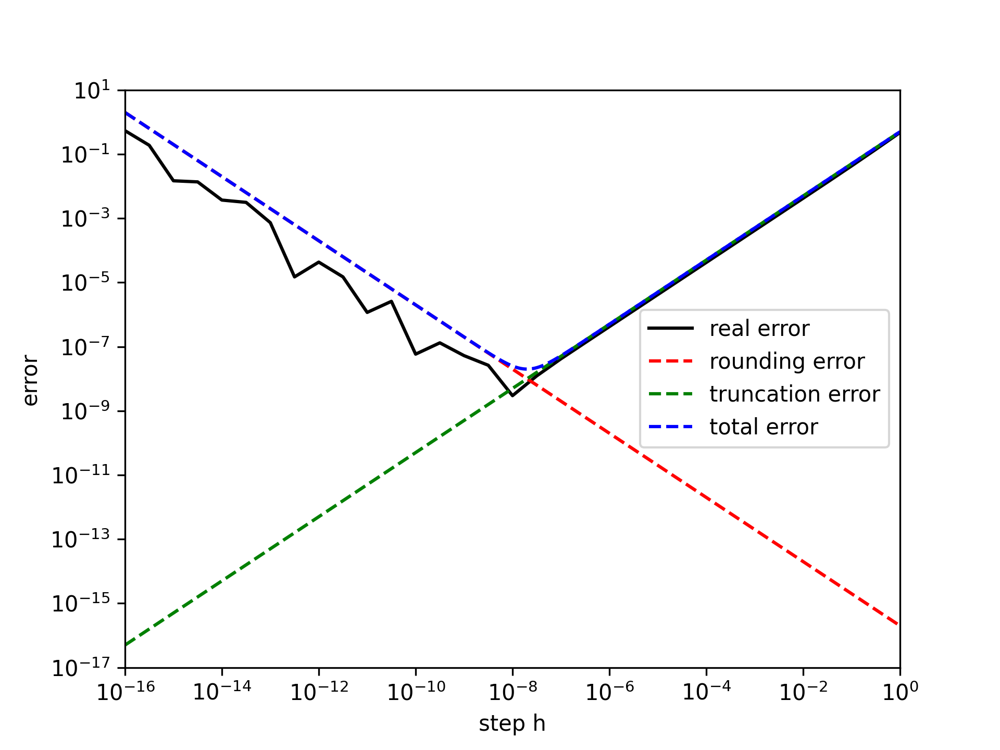

# 实验一

## 第一章上机题1

### 解题思路

按照书上的理论分析，绘制函数 $f(x) = \sin(x)$ 差商近似导数的实际总误差、理论截断误差、理论舍入误差、理论总误差限。

### 实验结果

#### 关键代码

计算实际总误差时，用 $|\cos(x) - \frac{\sin(x+h)-\sin(x)}{h}|$ 作为实际总误差

```python
x = 1
approx_der = (f(x + step) - f(x)) / step
real_der = f_der(x)
eps = np.abs(approx_der - real_der)
```

#### 绘图

不同步长取值对应的差商近似导数误差如下图所示（见 `lab1-1.png` ）



### 实验结论

与书上图 1-2 基本一致：

+ 当 $h\approx 10^{-8}$ 时，总误差最小
+ 当 $h \ll 10^{-8}$ 时，误差主要由舍入误差组成
+ 当 $h \gg 10^{-8}$ 时，误差主要由截断误差组成

## 第一章上机题3

### 解题思路

+ 程序单精度计算调和级数求和，记录求和结果不再变化时的 $n$ 并于理论分析结果比较
+ 使用双精度浮点数再次计算，并比较与单精度计算结果的绝对误差和相对误差
+ 理论估计双精度下 $n$ 的大小，并估算运行时间

### 实验结果

#### 理论分析

利用 (1) 式估计计算过程中的级数求和结果

$$
\sum_{i=1}^{n}\frac{1}{i} = \ln n + \gamma + \varepsilon_k, \quad \varepsilon_k \approx \frac1{2n}
$$

当求和结果不再变化时，转化为求解不等式

$$
\frac{1}{n} \le \frac{1}{2} \varepsilon_\text{mach} (\ln n + \gamma + \frac{1}{2n})
$$

#### 关键代码

+ 单精度、双精度调和级数求和

  ```python
  def single_precision():
      sum = np.float32(0)
      n = 1
      while True:
          _sum = sum
          sum += np.float32(1) / np.float32(n)
          if sum == _sum:
              print('float32 n = {}, sum = {}'.format(n, sum))
              break
          n += 1
      return n, sum
  
  def double_precision(n):
      sum = np.float64(0)
      for i in range(n):
          sum += np.float64(1) / np.float64(i + 1)
      print('float64 n = {}, sum = {}'.format(n, sum))
      return sum
  ```

+ 用双精度结果估计单精度结果误差

  ```python
  n, sum_32 = single_precision()
  sum_64 = double_precision(n)
  absolute_error = np.abs(sum_64 - sum_32)
  relative_error = absolute_error / sum_64
  print('absolute error = {:.3f}, relative error = {:.3%}'.format(
      absolute_error, relative_error))
  ```

+ 解不等式分析使得求和结果不变的最小的 $n$

  ```python
  def solve(eps_mach):
      n = fsolve(lambda n: 2 / n - eps_mach *
                 (np.log(n) + np.euler_gamma + 0.5 / n), 1)
      return n
  ```

#### 运行输出

```bash
float32 n = 2097152, sum = 15.403682708740234
float64 n = 2097152, sum = 15.133306695078193
absolute error = 0.270, relative error = 1.787%
float32 solved n = [2209628.8738786]
float64 solved n = [5.22654037e+14]
```

### 实验结论

+ 当 $n=2097152$ 时，求和结果不再变化，而通过理论分析解方程得到的 $n \approx 2209629$ ，与实际结果接近，误差来源于对求和的近似导致的截断误差以及求解方程时的舍入误差
+ 使用双精度浮点数计算求和结果，评估单精度求和结果的绝对误差为 $0.270$ ，相对误差为 $1.787\%$
+ 类似对单精度计算求和的理论分析，求解不等式得到 $n \approx 5.23 \times 10^{14}$ 。按照本机使用 C 程序计算 $n=10^{10}$ 时级数求和花费 30s 估算，大约需要 $\frac{30\text{ s}}{10^{10}} \times 5.23\times 10^{14} \approx 18 \text{ days}$ ，大约需要 18 天
