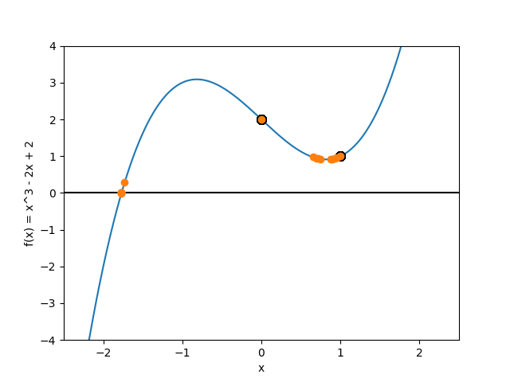
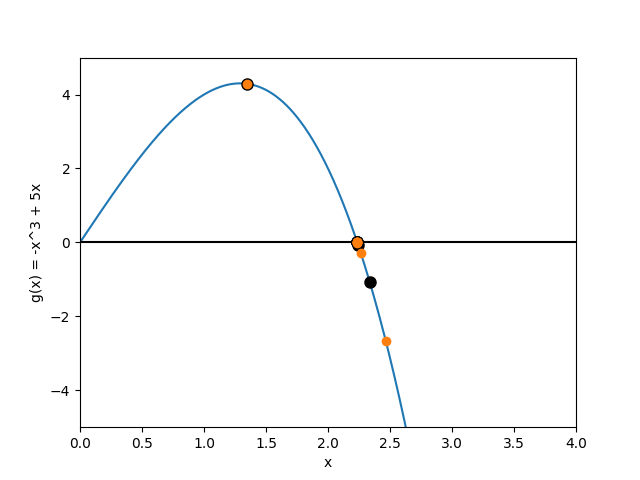
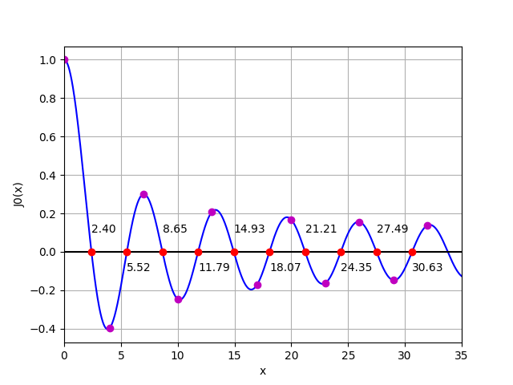

# 实验二

## 第二章上机题2

### 解题思路

+ 按照教材实现牛顿法和牛顿下山法，主要参数为函数、函数导数和初始值，最大迭代次数设置为 100 ，收敛判定条件设定为残差不超过阈值 1e-16 ，下山因子序列初值为 1 ，每次缩减 10% 

+ 使用 `scipy.optimize.newton` 作为 baseline 

### 实验结果

#### 关键代码

+ 牛顿法（略去打印信息、绘图部分）

  ```python
  x = x0
  converged = False
  for _ in range(max_iter):
      new_x = x - f(x) / f_der(x)
      if np.abs(new_x - x) < eps:
          converged = True
          break
      x = new_x
  ```

+ 牛顿下山法（略去打印信息、绘图部分）

  ```python
  x = x0
  converged = False
  for _ in range(max_iter):
      s = f(x) / f_der(x)
      new_x = x - s
      if np.abs(new_x - x) < eps:
          converged = True
          break
      i = 1
      while np.abs(f(new_x)) >= np.abs(f(x)):
          new_x = x - s * np.power(0.9, i)
          i += 1
      x = new_x
  ```

#### 运行输出

+ 求解第一个方程时，牛顿法未收敛，牛顿下山法和 `scipy` 牛顿方法的结果基本一致

+ 求解第二个方程时，所有方法均得到相同的解，其中牛顿下山法只需 6 步收敛，普通的牛顿法需要 10 步收敛

+ 以下为程序标准输出（每个迭代步的近似解和下山因子打印在 `stderr` 中，在此处不做展示）

  ```bash
  solve f(x) = 0, x0 = 0.0
  newton method: root = 0.0, steps = 100, converged = False
  newton downhill method: root = -1.7692923542386314, steps = 14, converged = True
  scipy newton method: root = -1.7692923542385164, converged = True
  ----------------------------------------
  solve f(x) = 0, x0 = 1.35
  newton method: root = 2.23606797749979, steps = 10, converged = True
  newton downhill method: root = 2.23606797749979, steps = 6, converged = True
  scipy newton method: root = 2.23606797749979, converged = True
  ----------------------------------------
  ```

#### 绘图

绘图观察两种方法的收敛情况。

+ 求解第一个方程

  + 牛顿法未收敛，近似解在 0 和 1 之间来回跳动（见下图黑色点）
  + 牛顿下山法收敛（见下图橙色点）

  

+ 求解第二个方程

  + 牛顿法、牛顿下山法均收敛（分别见下图黑色点、橙色点）

    

### 实验结论

本实验中，两个方程使用牛顿下山法求解的表现均优于普通的牛顿法。在第一个方程中，牛顿法无法达到收敛解，而牛顿下山法能收敛；在第二个方程中，牛顿收敛法也比普通的牛顿法收敛更快。

## 第二章上机题3

### 解题思路

使用 python 实现教材上的 fzerotx 程序，绘制 $J_0(x)$ 曲线，并据图估计前 10 个正零点的区间，然后在每个区间内运行 fzerotx 算法求解零点，并把零点绘制在图上予以验证。

### 实验结果

#### 关键代码

根据教材上的 matlab 代码实现。

```python
def fzerotx(f, range):
    a, b = range
    fa = f(a)
    fb = f(b)
    if np.sign(fa) == np.sign(fb):
        print("Error: f(a) and f(b) must have opposite signs")
        return None
    c = a
    fc = fa
    d = b - c
    e = d
    while fb != 0:
        if np.sign(fa) == np.sign(fb):
            a = c
            fa = fc
            d = b - c
            e = d
        if abs(fa) < abs(fb):
            c = b
            b = a
            a = c
            fc = fb
            fb = fa
            fa = fc
        m = 0.5 * (a - b)
        tol = 2.0 * np.finfo(float).eps * max(abs(b), 1.0)
        if abs(m) <= tol or fb == 0.0:
            break
        if abs(e) < tol or abs(fc) <= abs(fb):
            d = m
            e = m
        else:
            s = fb / fc
            if a == c:
                p = 2.0 * m * s
                q = 1.0 - s
            else:
                q = fc / fa
                r = fb / fa
                p = s * (2.0 * m * q * (q - r) - (b - c) * (r - 1.0))
                q = (q - 1.0) * (r - 1.0) * (s - 1.0)
            if p > 0:
                q = -q
            else:
                p = -p
            if 2.0 * p < 3.0 * m * q - abs(tol * q) and p < abs(0.5 * e * q):
                e = d
                d = p / q
            else:
                d = m
                e = m
        c = b
        fc = fb
        if abs(d) > tol:
            b += d
        else:
            b += np.sign(m) * tol
        fb = f(b)
    return b
```

#### 运行输出

```bash
the 1th zero of J0 is 2.4048255576957724
the 2th zero of J0 is 5.5200781102863115
the 3th zero of J0 is 8.653727912911013
the 4th zero of J0 is 11.791534439014281
the 5th zero of J0 is 14.930917708487785
the 6th zero of J0 is 18.071063967910924
the 7th zero of J0 is 21.21163662987926
the 8th zero of J0 is 24.352471530749302
the 9th zero of J0 is 27.493479132040253
the 10th zero of J0 is 30.63460646843198
```

#### 绘图

如下图，紫色点为零点估计区间的端点，红色点为求解出的零点。



#### 实验结论

利用基于 zeroin 算法实现的 fzerotx 程序，能够快速求解出第一类零阶贝塞尔曲线的前 10 个正零点。
