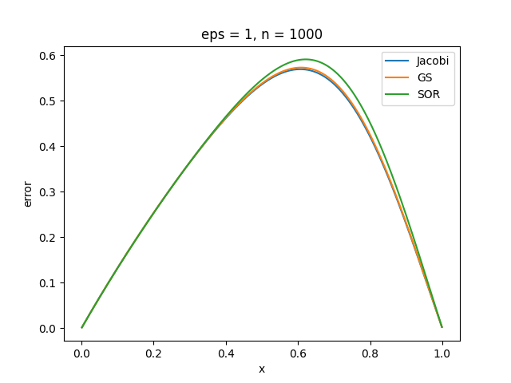
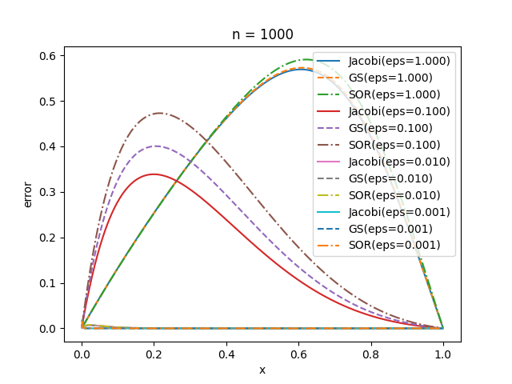
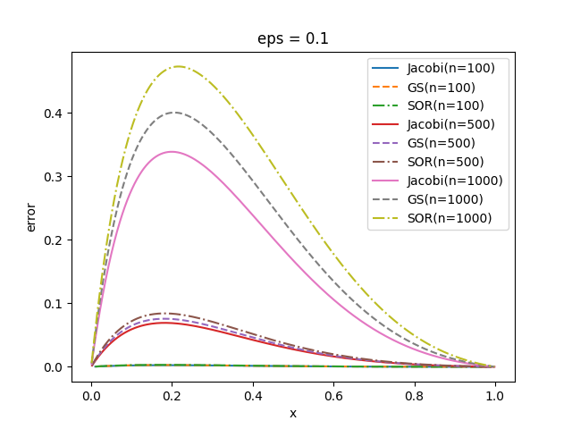
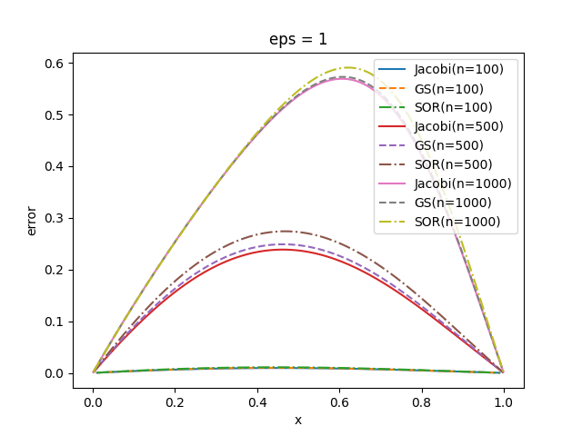
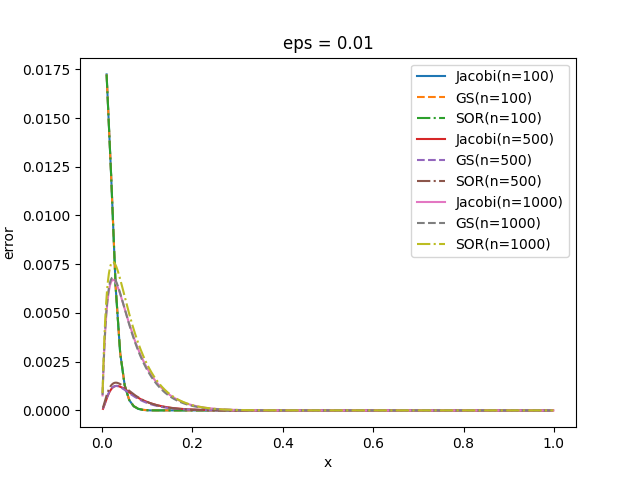
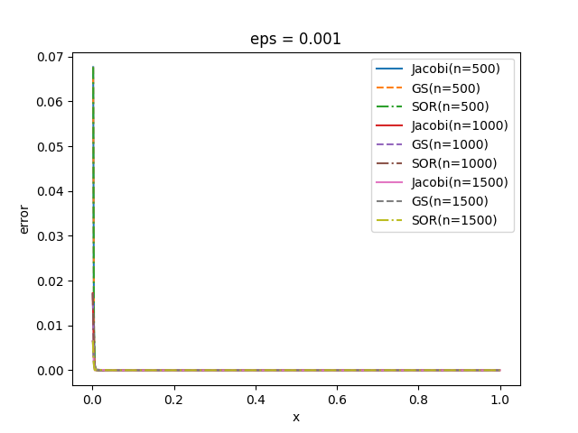

# 实验四

## 第四章上机题2

### 解题思路

按照教材中的压缩稀疏行（CSR）存储矩阵，并针对稀疏矩阵的特性实现雅可比、 G-S 和 SOR 方法迭代求解线性方程组，然后通过设置不同的 $n$ 和 $\varepsilon$ 研究问题的性质。

### 实验结果

#### 关键代码

+ 稀疏矩阵存储方式

  + 采用更加通用的存储方式，没有针对本题中特殊的三对角矩阵设计更加节省的存储方式

  ```python
  class SparseMatrix:
      class Item:
          def __init__(self, col, value):
              self.col = col
              self.value = value
  
      def __init__(self, n, m):
          self.n = n
          self.m = m
          self.row_start = np.zeros(n + 1, dtype=int)
          self.items = []
  ```

+ 雅可比迭代法

  ```python
  def Jacobi(A, b, tol):
      '''
      Jacobi(A, b, tol)
  
      A: coefficient matrix
      b: right hand side vector
      tol: tolerance
  
      returns: x, number of iterations
      '''
      n = len(b)
      x = np.zeros_like(b)
      iter_count = 0
      while True:
          last_x = x.copy()
          iter_count += 1
          for i in range(n):
              A_ii = next(
                  (item.value for item in A.items[A.row_start[i]:A.row_start[i + 1]] if item.col == i), None)
              if A_ii is None:
                  raise ValueError('Diagonal element not found')
              x[i] = reduce(lambda acc, item: (acc - item.value * last_x[item.col])
                            if item.col != i else acc, A.items[A.row_start[i]:A.row_start[i + 1]], b[i]) / A_ii
          if np.linalg.norm(x - last_x, np.inf) <= tol:
              return x, iter_count
  ```

+ G-S 迭代法

  ```python
  def GS(A, b, tol):
      '''
      GS(A, b, tol)
  
      A: coefficient matrix
      b: right hand side vector
      tol: tolerance
  
      returns: x, number of iterations
      '''
      n = len(b)
      x = np.zeros_like(b)
      iter_count = 0
      while True:
          last_x = x.copy()
          iter_count += 1
          for i in range(n):
              A_ii = next(
                  (item.value for item in A.items[A.row_start[i]:A.row_start[i + 1]] if item.col == i), None)
              if A_ii is None:
                  raise ValueError('Diagonal element not found')
              x[i] = reduce(lambda acc, item: (acc - item.value * x[item.col])
                            if item.col != i else acc, A.items[A.row_start[i]:A.row_start[i + 1]], b[i]) / A_ii
          if np.linalg.norm(x - last_x, np.inf) <= tol:
              return x, iter_count
  ```

+ SOR 迭代法

  + $\omega$ 取 0.95 ，为低松弛迭代法

  ```python
  def SOR(A, b, tol, omega=0.95):
      '''
      SOR(A, b, tol, maxiter, omega)
  
      A: coefficient matrix
      b: right hand side vector
      tol: tolerance
      omega: relaxation parameter
  
      returns: x, number of iterations
      '''
      n = len(b)
      x = np.zeros_like(b)
      iter_count = 0
      while True:
          last_x = x.copy()
          iter_count += 1
          for i in range(n):
              A_ii = next(
                  (item.value for item in A.items[A.row_start[i]:A.row_start[i + 1]] if item.col == i), None)
              if A_ii is None:
                  raise ValueError('Diagonal element not found')
              x[i] = (1 - omega) * x[i] + omega * \
                  (reduce(lambda acc, item: (acc - item.value * x[item.col])
                          if item.col != i else acc, A.items[A.row_start[i]:A.row_start[i + 1]], b[i])) / A_ii
          if np.linalg.norm(x - last_x, np.inf) <= tol:
              return x, iter_count
  ```

#### 运行输出

+ 标准输出

  + 以下只截取 $\varepsilon=1$ 的相关输出，完整输出见 `lab4-stdout.txt`

  ```bash
  Ja  method: eps = 1, a = 0.5, n = 100, iters = 8622, max error = 0.009468145951874063, time = 1.498 s
  GS  method: eps = 1, a = 0.5, n = 100, iters = 4299, max error = 0.009869141253456226, time = 0.754 s
  SOR method: eps = 1, a = 0.5, n = 100, iters = 4639, max error = 0.010911266557022237, time = 0.915 s
  Ja  method: eps = 1, a = 0.5, n = 500, iters = 55865, max error = 0.2385961434127618, time = 49.071 s
  GS  method: eps = 1, a = 0.5, n = 500, iters = 27023, max error = 0.24883427002953729, time = 23.561 s
  SOR method: eps = 1, a = 0.5, n = 500, iters = 27172, max error = 0.2740253615545343, time = 27.357 s
  Ja  method: eps = 1, a = 0.5, n = 1000, iters = 53242, max error = 0.5690236741552016, time = 93.497 s
  GS  method: eps = 1, a = 0.5, n = 1000, iters = 26286, max error = 0.5727298137292847, time = 46.480 s
  SOR method: eps = 1, a = 0.5, n = 1000, iters = 26218, max error = 0.5907227500489345, time = 52.340 s
  ```

#### 绘图

+ 当 $n=1000,\varepsilon=1$ 时，三种方法的误差如下图

  + 三种方法误差接近，但 G-S 和 SOR 收敛速度明显快于雅可比迭代法

  + SOR 误差较大，收敛速度慢于 G-S 的原因可能是参数 $\omega$ 的设置小于 1 ，即采用低松弛迭代法

    

+ $n=1000$ ， $\varepsilon$ 取 $1,\  0.1,\  0.01,\  0.001$ 时，三种方法误差变化情况如下图

  + 可以发现，三种方法的误差均随 $\varepsilon$ 的减小而减小，这也十分符合直觉，即 $\varepsilon$ 越小， $e^{-1/\varepsilon}$ 越趋近于 0 ，原常微分方程的解越接近于线性函数，从而离散得到的线性方程组的解的误差越小

    

+ 当 $\varepsilon$ 取较大值如 $0.1,1$ 时，三种方法误差关于 $n$ 大小的变化情况如下

  + 可以发现，随着 $n$ 的增大，误差反而增大，一个可能的解释是：当 $\varepsilon$ 较大时，原常微分方程的解具有较强的非线性；而相反地随着 $n$ 增大，线性方程组的解具有更强的线性，因此对非线性函数的拟合效果越差，误差也就越大
  

+ 当 $\varepsilon$ 取较小值如 $0.01,0.001$ 时，三种方法误差关于 $n$ 大小的变化情况如下

  + 可以发现，随着 $n$ 的增大，误差减小，可以从两方面对此进行直观解释：一方面，与 $\varepsilon$ 取较大值时对比，当 $\varepsilon$ 较小时，原常微分方程的解具有较强的线性，而同时随着 $n$ 增大，线性方程组的解具有更强的线性，因此对近似线性函数的拟合效果越好，误差也越小；另一方面，从直觉来看，当 $n$ 逐渐增大，离散化的步长 $h$ 也就越小，从而离散的线性方程组能更好地近似原常微分方程，误差也就越小
  
  

### 实验结论

+ 本次实验，实现了线性方程组的雅可比、 G-S 和 SOR 迭代法，并针对稀疏矩阵做了通用的存储优化和算法优化
+ 通过运行程序，打印误差并绘图进行分析，可以发现三种迭代法具有不同的收敛速度和误差；综合来看， G-S 具有更稳定的表现
